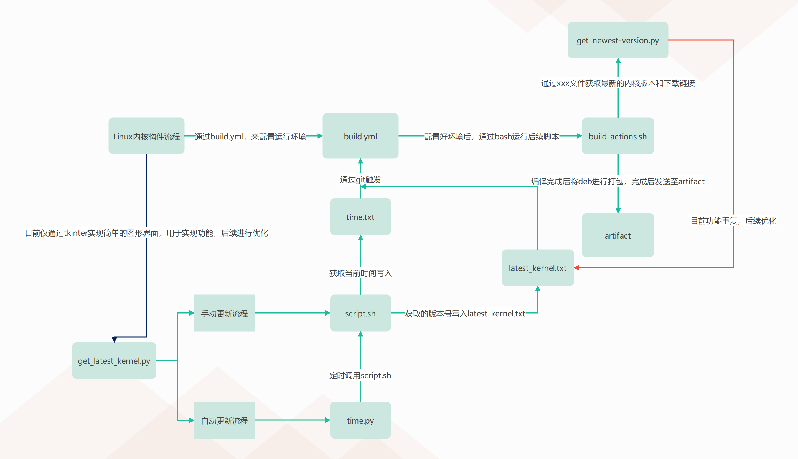

# kernel_deb_builder

利用 GitHub Actions 自动编译 Linux 内核为 deb 包。

# 如何使用

如果您想要利用我的这个自动化脚本根据自己的需求编译内核，请参考如下步骤：

#### 1. Fork 仓库

访问 [XXTX-TOP/Linux-kernel_deb_builder (github.com)](https://github.com/XXTX-TOP/Linux-kernel_deb_builder)，点击右上角的 `Fork` 按钮，并 clone 到本地

#### 2. 更新 config 文件

在本地将您获取的 config 文件替换根目录下的 `config`，可以从您系统的 `/boot/config*` 文件复制，或者手动编辑

#### 3. 编写自定义修改脚本

当前 `/patch.d/` 目录下的修改脚本是只针对我自己的需求编写的，建议您先将其删掉，然后编写自己的脚本放在这个目录下，在脚本执行过程中会自动应用该目录下的所有脚本

#### 4. 推送修改

推送后，action 自动触发，可以在您的仓库页面的 `Actions` 选项卡查看进度详情。

#### 5.下载解压安装

在您的仓库页面的 `Actions`里面下载[artifact](https://github.com/XXTX-TOP/Linux-kernel_deb_builder/suites/13914141709/artifacts/774503646) 【示例】，然后解压安装后通过sudo dpkg -i +包名 即可

